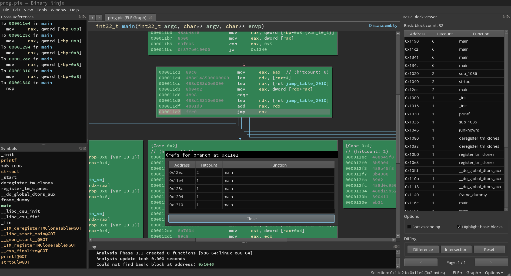
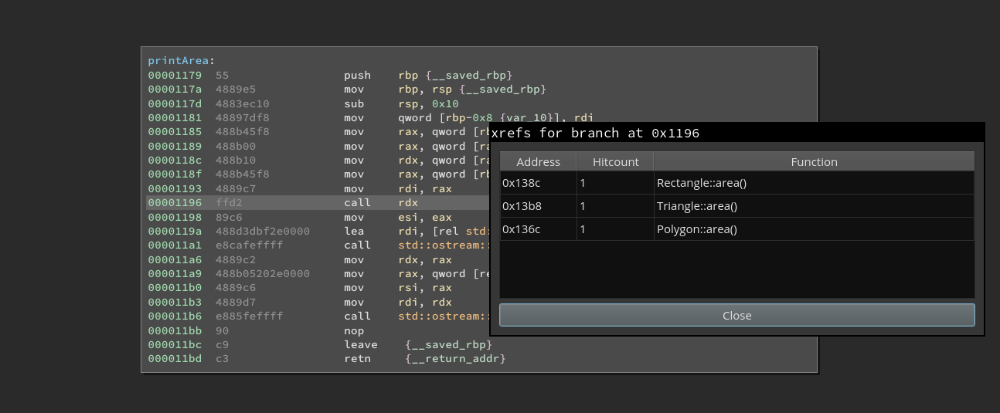

# wakare-ui
wakare-ui is a binary ninja plugin providing tools to use the trace databases generated by wakare-converter. You can find the plugin in "Tools/Wakare" within binja.

- Wakare project: https://github.com/lse/wakare

## Installation
Copy or symlink the binja-wakare folder to your binary ninja plugin folder.

## Features
- Basic block listing
- Basic block coloration
- Basic block diffing (Difference / Intersection)
- Branch target resolution (right click on calls/jumps)
- Supports PIE executables/traces

## Requirements
- python 3
- Binary ninja version > 1.11689 (needs UI plugin support)

## Screenshot


## Example usage
Sometimes when reverse engineering we can encounter C++ libraries making use of virtual calls. This can be troublesome as this resolution happens at runtime and statically all we have is an indirect call. Fortunately using an execution trace we can recover these indirect calls easily. We can take as an example the following code (borrowed from the blog post here: https://blog.trailofbits.com/2017/02/13/devirtualizing-c-with-binary-ninja/).

```cpp
// Simple virtual function example, based on http://www.cplusplus.com/doc/tutorial/polymorphism/
// compiled with:
// x86_64 -> g++ virtual-test.cpp -o virtual-test
// arm -> arm-linux-gnueabi-g++ virtual-test.cpp -o virtual-test-arm
#include <iostream>
using namespace std;

class Polygon {
  protected:
    int width, height;
  public:
    void set_values (int a, int b)
      { width=a; height=b; }
    virtual int area ()
      { return 0; }
    virtual int sides ()
      { return 0; }
};

class Rectangle: public Polygon {
  public:
    int area ()
      { return width * height; }
    int sides ()
      { return 4; }
};

class Triangle: public Polygon {
  public:
    int area ()
      { return (width * height / 2); }
    int sides ()
      { return 3; }
};

void printArea(Polygon* poly)
{
  cout << poly->area() << endl;
}

void printSides(Polygon* poly)
{
  cout << poly->sides() << endl;
}

int main () {
  Rectangle rect;
  Triangle trgl;
  Polygon poly;
  Polygon * ppoly1 = &rect;
  Polygon * ppoly2 = &trgl;
  Polygon * ppoly3 = &poly;
  ppoly1->set_values(4,5);
  ppoly2->set_values(4,5);
  ppoly3->set_values(4,5);
  printArea(ppoly1);
  printSides(ppoly1);
  printArea(ppoly2);
  printArea(ppoly3);
  return 0;
}
```

If we load a trace database and try to get the xref from an indirect virtual call we get this:

